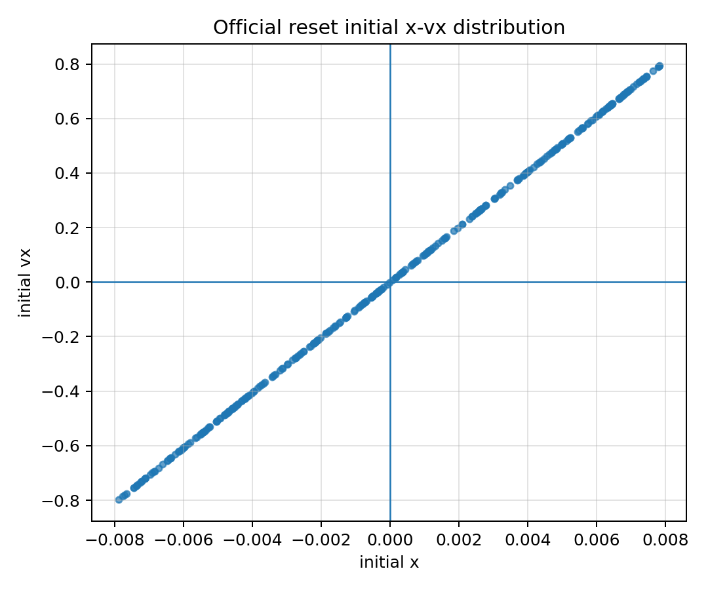
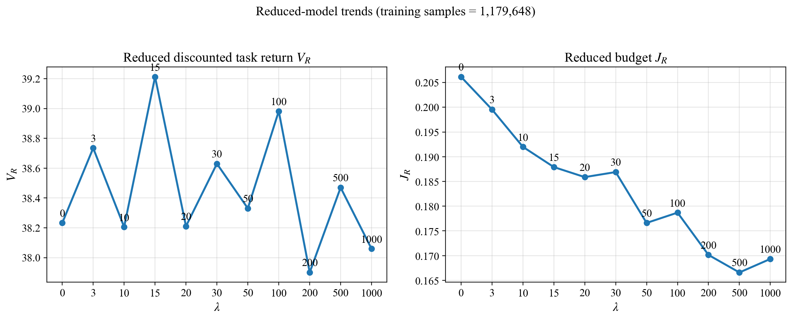
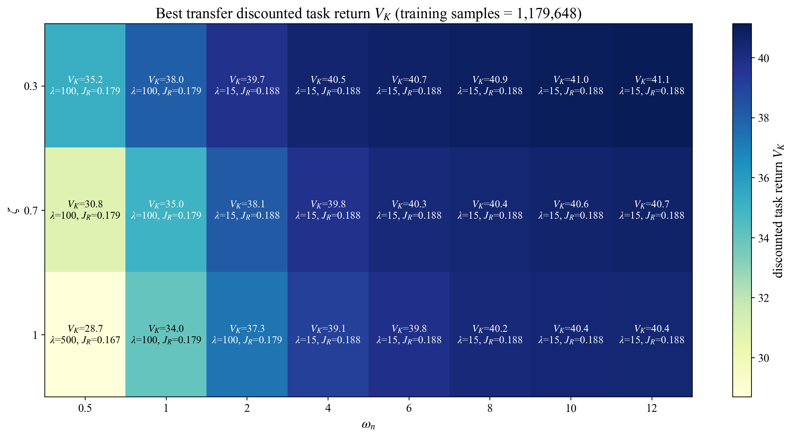
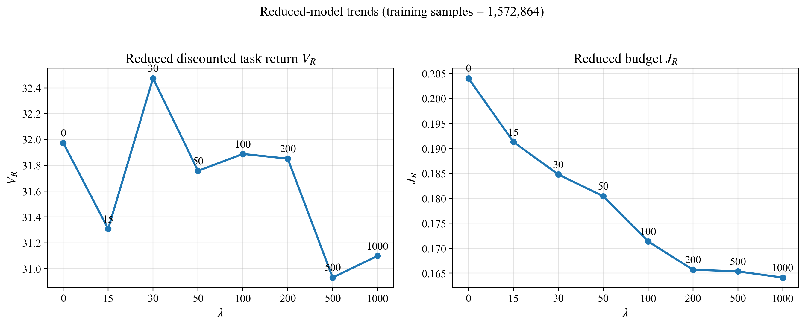
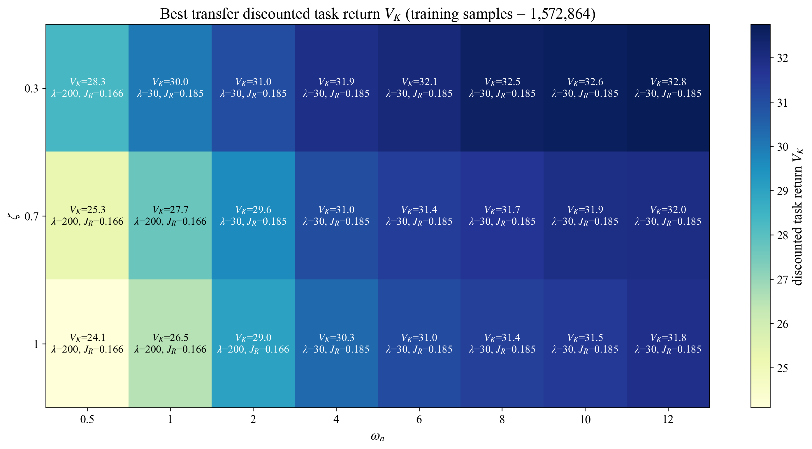
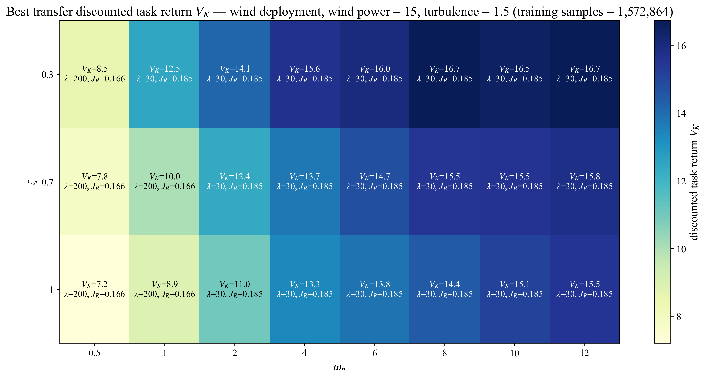

# Zero-Shot Transfer from Reduced-Order to Full LunarLander

**Author:** Shima Rabiei

This repository contains code and results for studying zero-shot transfer from a reduced-order LunarLander model to the full LunarLander model. The reduced policy is trained in a simplified environment where it commands a desired attitude reference. During deployment, the same policy is evaluated in the full LunarLander model, and an inner-loop controller tracks the commanded attitude.

The goal is to study whether penalizing rapid changes in the commanded attitude during reduced-order training can improve transfer to the full-order system.

---

## Background: Official LunarLander

The official continuous LunarLander observation is

$$
(x,\; y,\; v_x,\; v_y,\; \theta,\; \dot{\theta},\; c_L,\; c_R),
$$

where $x,y$ are the lander position coordinates, $v_x,v_y$ are the linear velocities, $\theta$ is the attitude angle, $\dot{\theta}$ is the angular velocity, and $c_L,c_R$ indicate left and right leg contact.

The continuous action has two components,

$$
u = (u_{\mathrm{main}},\; u_{\mathrm{side}}),
$$

where $u_{\mathrm{main}}$ controls the main engine and $u_{\mathrm{side}}$ controls the side boosters.

The official reward includes shaping terms for distance to the landing pad, velocity, angle, leg contact, main-engine fuel use, side-engine fuel use, and terminal crash or landing rewards. An episode terminates when the lander crashes, leaves the viewport, or becomes not awake. This repository keeps the official not-awake/sleep condition as part of the landing termination logic.

---

## Reduced-Order LunarLander

The reduced model abstracts away the rotational dynamics. The policy does not observe the actual angle $\theta$ or angular velocity $\dot{\theta}$. Instead, the policy directly commands a desired attitude reference $\theta_t^\star$.

The reduced policy observation is

$$
o_t^R =
(x_t,\; y_t,\; v_{x,t},\; v_{y,t},\; \theta_{t-1}^\star,\; c_{L,t},\; c_{R,t}).
$$

The previous commanded attitude $\theta_{t-1}^\star$ is included in the observation so that the attitude-reference variation is available to the policy.

The reduced policy action is

$$
a_t^R = (u_{\mathrm{main},t},\; a_{\theta,t}),
$$

where

$$
\theta_t^\star = \theta_{\max} a_{\theta,t},
\qquad
 a_{\theta,t}\in[-1,1].
$$

In the experiments in this repository,

$$
\theta_{\max}=20^\circ.
$$

During reduced-order training, the commanded attitude is imposed directly in the reduced environment. The reduced model therefore removes the attitude dynamics and does not simulate the side boosters required to realize $\theta_t^\star$. The reduced model keeps the translational effect of the main engine under the commanded attitude, but it does not include side-thruster actuation or side-thruster fuel penalty.

---

## Training Reward

The reduced model distinguishes between the task reward and the training reward. The task reward follows the LunarLander-style shaping and terminal reward structure, with main-engine fuel penalty included. Since the reduced model does not use side-thruster actions, there is no side-thruster fuel penalty in reduced-order training.

The training reward is

$$
r_t^{\mathrm{train}}
=
r_t^{\mathrm{task}}
-
\lambda
\left|\theta_t^\star-\theta_{t-1}^\star\right|
-
c_{\mathrm{step}}.
$$

The step penalty used in the experiments is

$$
c_{\mathrm{step}} = 0.02.
$$

The commanded-attitude variation term is

$$
c_t^{\theta}
=
\left|\theta_t^\star-\theta_{t-1}^\star\right|.
$$

The corresponding discounted reference-variation objective is

$$
J_R(\pi)
=
\mathbb{E}_{R,\pi}
\left[
\sum_{t=0}^{\infty}
\gamma^t
\left|\theta_t^\star-\theta_{t-1}^\star\right|
\right].
$$

The parameter $\lambda$ is used as a Lagrange-style weight to encourage smoother commanded-attitude sequences during reduced-order training.

---

## Full-Order Deployment

During deployment, the same reduced policy is evaluated in the full LunarLander model. The full model has rotational dynamics and side thrusters. The reduced policy still outputs

$$
(u_{\mathrm{main},t},\; \theta_t^\star),
$$

but now $\theta_t^\star$ is only a reference. The actual angle $\theta_t$ must track this reference through an inner-loop controller.

The policy input during full deployment is constructed from the full observation as

$$
o_t^K =
(x_t,\; y_t,\; v_{x,t},\; v_{y,t},\; \theta_{t-1}^\star,\; c_{L,t},\; c_{R,t}).
$$

The full angle $\theta_t$ and angular velocity $\dot{\theta}_t$ are not given to the policy. They are used only by the inner-loop controller.

---

## Inner-Loop PD Controller

The deployed inner-loop controller tracks the commanded attitude reference using a PD law. The attitude tracking error is

$$
e_t = \operatorname{wrap}(\theta_t^\star-\theta_t).
$$

The derivative of the reference is estimated using a filtered finite difference:

$$
\dot{\theta}_{f,t}^\star
=
\alpha \dot{\theta}_{f,t-1}^\star
+
(1-\alpha)
\frac{
\operatorname{wrap}(\theta_t^\star-\theta_{t-1}^\star)
}{\Delta t}.
$$

The controller effort is

$$
u_t^{\mathrm{effort}}
=
K_p e_t
+
K_d
\left(
\dot{\theta}_{f,t}^\star-\dot{\theta}_t
\right).
$$

The gains are parameterized by natural frequency and damping ratio:

$$
K_p=\omega_n^2,
\qquad
K_d=2\zeta\omega_n.
$$

The controller effort is mapped to the side-thruster command of the full LunarLander. When leg contact is detected, the side command can be set to zero to avoid unnecessary side actuation after touchdown.

---

## Reset Distributions

This repository contains two main experimental settings.

### Official reset

In the official reset setting, the reduced policy is trained and evaluated using the default LunarLander reset distribution. The official reset distribution produces a narrow and highly structured relationship between the initial lateral position and lateral velocity.



Results for this setting are stored in

```text
results/official_reset_12upd/
models/official_reset_12upd/
media/videos/official_reset_12upd/
```

### Lateral reset

In the lateral reset setting, the reduced policy is trained using a wider lateral reset distribution:

$$
x_0 \sim \mathrm{Uniform}[-0.8,0.8],
$$

$$
v_{x,0} \sim \mathrm{Uniform}[-0.8,0.8].
$$

This setting is used to evaluate transfer under stronger lateral motion than the official reset distribution.

Results for this setting are stored in

```text
results/lateral_reset_x08_vx08_12upd/
models/lateral_reset_x08_vx08_12upd/
media/videos/lateral_reset_x08_vx08_12upd/
```

Some internal script names use the word `stress` because this reset was originally developed as a stress-test setting. In the repository documentation, it is referred to as the lateral reset.

---

## Training Protocol

The training pipeline follows three stages.

### Stage 1: cold training

A reduced-order $\lambda=0$ policy is trained from scratch.

### Stage 2: warm continuation

The $\lambda=0$ policy is warm-started and trained further to obtain a stronger base policy.

### Stage 3: lambda sweep

From the warm base, policies are trained for different values of $\lambda$. These policies are then transferred to the full LunarLander model and evaluated over a grid of inner-loop gains.

For the official-reset experiments, the lambda sweep includes

$$
\lambda \in
\{0,3,10,15,20,30,50,100,200,500,1000\}.
$$

For the lateral-reset experiments, the lambda sweep includes

$$
\lambda \in
\{0,15,30,50,100,200,500,1000\}.
$$

---

## Results

The repository includes reduced-model trends, full-order deployment summaries, transfer heatmaps, and selected deployment videos for both reset settings.

### Official reset

Reduced-model trends:



Best deployed task return over the gain grid:



### Lateral reset

Reduced-model trends:



Best deployed task return over the gain grid:



### Wind deployment variant

The lateral-reset policies are trained without wind. We also evaluate the same trained policies in the full LunarLander with wind enabled, using wind power $15.0$ and turbulence power $1.5$. This is a deployment-only change; no additional wind training is used.

Wind-deployment heatmaps are stored in

```text
results/lateral_reset_x08_vx08_12upd/wind_power15_turbulence1p5/
```

Best deployed task return under wind:



Additional heatmaps for tracking error and deployed reference variation are stored in each `transfer_heatmaps/` folder.

---

## Videos

Selected deployment videos are included for qualitative comparison.

Official-reset videos:

```text
media/videos/official_reset_12upd/
```

Lateral-reset videos:

```text
media/videos/lateral_reset_x08_vx08_12upd/
```

Selected wind-deployment GIFs:

```text
media/gifs/lateral_reset_x08_vx08_12upd/wind_power15_turbulence1p5/
```

The selected video folders include low-return, middle-case, and high-return deployment examples. These videos compare the reduced-order commanded behavior with the full-order deployed behavior under the inner-loop controller.

For inline display in GitHub, use one of the selected GIFs.

---

## Repository Structure

```text
src/
    Training, deployment, plotting, evaluation, and video-generation scripts.

commands/
    Command records used to reproduce the training and evaluation runs.

models/
    Selected final reduced-order policy checkpoints and summaries.

results/
    Reduced-model summaries, deployment summaries, heatmaps, and trend plots.

media/
    Selected deployment videos and GIFs.

legacy/
    Earlier prototype code and results kept for project history.
```

---

## Notes on the Legacy Folder

The folder

```text
legacy/early_simple_to_full_attempt/
```

contains an earlier version of the project. It is preserved only for project history and comparison. The current reduced-order training and full-order deployment pipeline is implemented in the main `src/`, `models/`, `results/`, and `media/` folders.

---

## Project Status

This is an active research repository. The code and results are organized to support experiments on transfer from reduced-order to full-order LunarLander dynamics with inner-loop attitude control.
